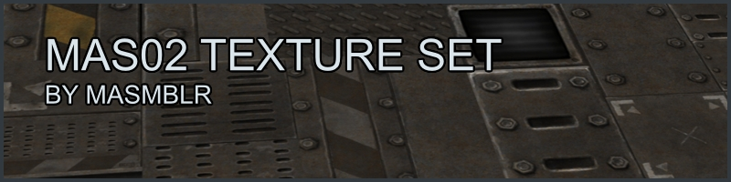

## Introduction
The **mas02** texture set is a collection of industrial textures.

The textures were used in two projects: [atcs_ds](https://github.com/Masmblr/map-atcs_ds_src) and [arena_ds](https://github.com/Masmblr/map-arena_ds_src).

## Files
| Type | Link |
|----------|-------|
| source| [click](https://github.com/Masmblr/mas02-Texture-Set/tree/main/src/) |
| ioquake3-dev | [click](https://github.com/Masmblr/mas02-Texture-Set/tree/ioquake3-dev)|
| ioquake3-bin | [click](https://github.com/Masmblr/mas02-Texture-Set/releases/tag/v1.0)|

## Credits & License
- **Matthias Peters**

A comprehensive list of all files and their respective licenses can be found in the following document:  
[→ Overview.txt](./docs/copyright/Overview.txt)
